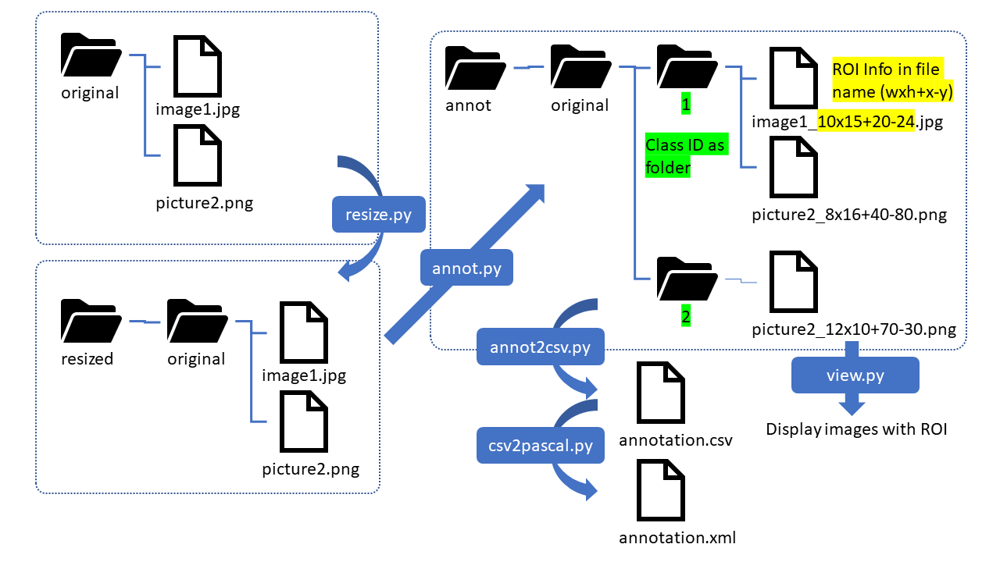

# Simple Annotation Toolkit (for Object Detection Dataset)
This is the most simple ROI for object detection task annotation toolkit. This toolkit consists of multiple simple tools. User can accomplish the annotation task by utilizing those tools.  
Each tool does single function to keep them simple. You can modify those tools to meet your needs.   
The intermediate data or representation are also very simple.  

これはとてもシンプルな物体検出タスク用のアノテーションツールキットです。ツールキットは単機能の細かいツールから構成されています。ユーザーはツールを組み合わせることでアノテーション作業を行います。  
ツールキット内のツールはどれも単機能でシンプルです。ユーザーの目的、嗜好に合わせてカスタムすることも可能です。  
中間データ形式やデータ表現も非常にシンプルでわかりやすくなっており、他のツールとの連携も容易です。  

## How to Run

All tool are Python scripts. Just run them.

## See Also  
* [Using Open Model Zoo demos](../../README.md)  
* [Model Optimizer](https://docs.openvinotoolkit.org/latest/_docs_MO_DG_Deep_Learning_Model_Optimizer_DevGuide.html)  
* [Model Downloader](../../../tools/downloader/README.md)  
