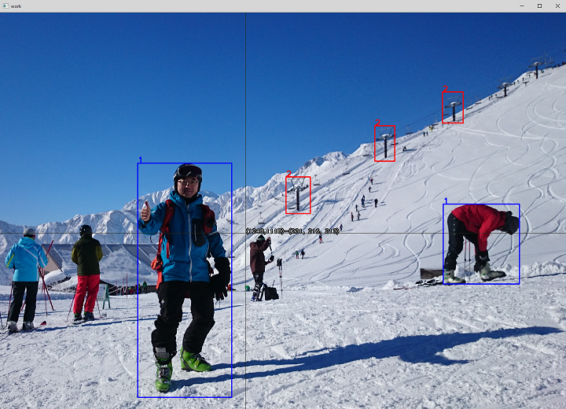

# Simple Annotation Toolkit (for Object Detection Task)
This is the most simple ROI annotation toolkit for the object detection task. This toolkit consists of multiple simple tools. User can accomplish the annotation task by utilizing those tools.  
Each tool does only single function, so the tools are simple. You can modify those tools to meet your needs if needed.  
The intermediate data and data representation are also very simple.  
This tool doesn't use any (complex and diffucult) database. It simply uses the file system to store and represent the ROI data. User can change or tweak annotation information intuitively by moving, or renaming the directory or the file name.  

これはとてもシンプルな物体検出タスク用のアノテーションツールキットです。ツールキットは単機能の細かいツールから構成されています。ユーザーはツールを組み合わせることでアノテーション作業を行います。  
ツールキット内のツールはどれも単機能でシンプルです。ユーザーの目的、嗜好に合わせてカスタムすることも可能です。  
中間データ形式やデータ表現も非常にシンプルでわかりやすくなっており、他のツールとの連携も容易です。  
このプログラムは複雑で面倒なデータベースを使っていません。シンプルにファイルシステムを利用してROIデータの表現を行っています。そのため、ファイルの移動、ディレクトリのリネームなどでアノテーション情報を直感的に操作できます。  

## How to Run

All tool are Python scripts. Just run them.

### Key bindings - annot.py
`q`: previous image
`w`: next image
`u`: undo (remove the last ROI in current image)
`0`-`9`: start / end of ROI (hit numeric key to start drawing ROI and hit numeric key to finish drawing. no need to keep pressing)
`W`: (capital) write annotation data to the output directory
`c`: toggle cursor info (x, y, color on the cursor)
`ESC`: exit program
